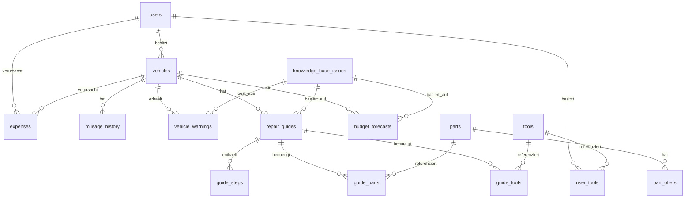

# Datenmodell

Vollständige DDL: [`../backend/schema.sql`](../backend/schema.sql) (PostgreSQL + `pgvector`).

## ER-Übersicht

## Designentscheidungen

- **`knowledge_base_issues` ist die Brücke zwischen RAG und strukturierten Abfragen.**
  Rohe Forenposts liegen *nicht* relational vor — sie werden in der Ingestion-Pipeline
  (siehe `03-architecture-rag.md`) zu strukturierten, deduplizierten Datensätzen mit
  `typical_mileage_from/to`, `avg_cost_workshop_eur` etc. verdichtet. Dadurch lässt
  sich "gib mir alle Issues für VW Polo IV zwischen 140.000–160.000 km" als reine
  SQL-Abfrage beantworten (schnell, deterministisch), während die Vektor-Suche nur
  für Freitext-Kontext/Belege nachgeladen wird.
- **`mention_count` + `confidence_score`** speisen sowohl die Sortierung der Warnungen
  als auch die Halluzinations-Guardrails (Abschnitt 3): ein Issue mit einer einzigen
  Forenerwähnung wird nicht als "typischer Mangel" ausgespielt.
- **`vehicle_warnings` ist eine n:m-Verknüpfung** zwischen Fahrzeug und Issue mit
  eigenem Lifecycle (`open → acknowledged → resolved/dismissed`), getrennt vom
  Wissenseintrag selbst — ein Issue kann für tausende Fahrzeuge gleichzeitig aktiv sein.
- **`repair_guides` sind pro Fahrzeug generierte Artefakte**, nicht global gecachte
  Texte, da Skill-Level und exakte Motorisierung/Baujahr die Anleitung beeinflussen.
  `llm_model_used` + `prompt_version` werden mitgespeichert für Reproduzierbarkeit
  und A/B-Testing der Prompt-Qualität.
- **`parts.compatible_makes/models`** ermöglicht den OEM-Kompatibilitätsfilter im
  Smart Parts Matcher, ohne dass jede Teile-Fahrzeug-Kombination einzeln gepflegt
  werden muss.
- **`expenses.source`** unterscheidet OCR-Import (Tankbeleg-Foto), CSV-Import
  (Kontoauszug) und manuelle Eingabe — wichtig für die Vertrauenswürdigkeit der
  Budget-Prognose (siehe Modul 04).
